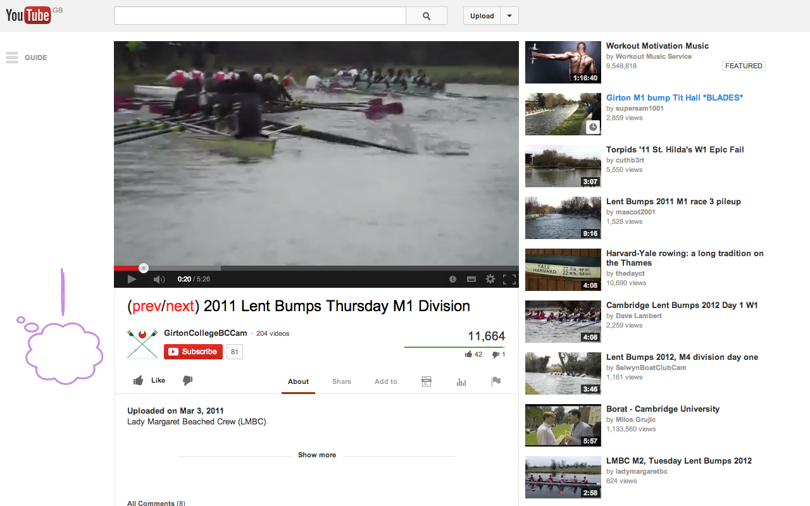

frame by frame
==============

https://chrome.google.com/webstore/detail/frame-by-frame/elkadbdicdciddfkdpmaolomehalghio

Google Chrome Extension to add frame by frame playback to YouTube.

Created by Calum J. Eadie (http://calumjeadie.com) and Tom D. Chambers (http://tomchambers.me).

Installation
------------

https://chrome.google.com/webstore/detail/frame-by-frame/elkadbdicdciddfkdpmaolomehalghio

How it works
------------

`frame by frame` uses Google Chrome's content scripts feature to add additional
behavour to the YouTube player.

<b>Hotkeys:</b>

<b>[ and ]</b> to seek by current frameskip (default 1)

<b>< and ></b> to decrease or increase frameskip by a factor of 2 respectively

<b>P</b> to toggle between minimum and normal playbackrate

<b>O</b> to toggle between 30 and 24 fps (default 30 fps)

License
-------

MIT

Contributions
-------------

Very much welcomed!

Resources
---------

http://developer.chrome.com/extensions/getstarted.html

http://developer.chrome.com/extensions/manifest.html

http://developer.chrome.com/extensions/content_scripts.html

http://userscripts.org/scripts/show/33042

http://stackoverflow.com/questions/9515704/building-a-chrome-extension-inject-code-in-a-page-using-a-content-script

http://developer.chrome.com/extensions/packaging.html

https://developers.google.com/chrome/web-store/docs/get_started_simple

http://developer.chrome.com/extensions/tut_analytics.html

https://developer.chrome.com/webstore/branding

https://developers.google.com/youtube/branding_guidelines

https://github.com/FortAwesome/Font-Awesome

https://github.com/encharm/Font-Awesome-SVG-PNG

http://fontello.com/

https://developer.chrome.com/webstore/images

http://www.hongkiat.com/blog/youtube-keyboard-shortcuts/
